# System Architecture Specification — Rumica

## Overview
Rumica is built as a **Bitrix24-centric thin-bridge architecture**: a modular monolith-style set of backend services (not independent microservices — there is no scale or team-topology driver for that split) fronts Bitrix24 Cloud, which hosts admin/back-office, CRM, catalog, and payment processing. Custom code is limited to what Bitrix24 cannot natively provide: the React/Three.js planner front end, a thin API Gateway/BFF, and a small set of bridge/adapter services (Auth Bridge, Commerce Bridge, Catalog Sync, Projects Service, Plan Recognition Adapter). This keeps custom build/maintenance surface to the minimum needed to satisfy MVP functional requirements, consistent with BR-4. Both architecture-level ambiguities raised during the prior review — Bitrix24 edition/plan and checkout implementation approach — are now resolved and reflected below as final decisions, not options.

## Context Diagram
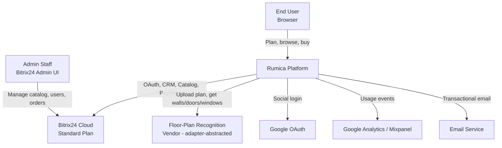

## Components
| Component | Responsibility | Technology | Why |
|---|---|---|---|
| Web Front End | React + Three.js SPA: planner canvas, catalog browsing, cart, custom checkout form, admin-adjacent user pages | React, Three.js | Three.js is the confirmed engine per the planner-engine comparison doc; React is the standard fit for an SPA of this shape |
| API Gateway / BFF | Single entry point for the front end; routes to bridge services; session/token validation | Node.js (or same stack as bridge services) reverse-proxy/BFF layer | Avoids exposing multiple internal service endpoints directly to the browser; centralizes auth-token handling |
| Auth Bridge | Bridges Rumica user identity to Bitrix24 OAuth; issues/validates Rumica session tokens; handles Google OAuth handoff | OAuth 2.0 against Bitrix24 + Google | Bitrix24-centric direction requires user identity to reconcile with Bitrix24 records for CRM/order linkage |
| Commerce Bridge | Owns cart state; renders/serves the **custom Rumica-built checkout form**; on submit, calls Bitrix24 Payment APIs directly to charge and creates/updates the corresponding CRM deal; handles subscription tier payments (FR-20) | Custom service, Bitrix24 REST (CRM + Payment APIs) | **Final decision:** custom checkout form chosen over Bitrix24's hosted widget for full UX/branding control (client-confirmed) — see PCI/security note below and Cost & Complexity Notes for the resulting build-effort implication |
| Catalog Sync/Proxy | Reads Bitrix24 catalog (products, packs, pricing) and serves it to the front end from a local read cache; kept fresh via Bitrix24 webhooks (create/update/delete) plus a periodic reconciliation poll | Custom service + cache store (e.g., Redis or a cached table) | **Final decision:** webhook-driven + periodic reconciliation (not live-proxying every request) is confirmed sufficient against Bitrix24 Cloud's standard-plan REST API rate limits |
| Projects Service | CRUD for planner projects (layout state, item placement, dimensions, public/private flag), since projects are not native Bitrix24 data | Custom service + Application DB + Object Storage | Bitrix24 has no concept of a 2D planner project; this data must live in Rumica's own store |
| Plan Recognition Adapter | Sends uploaded floor plans (JPG/PNG/PDF) to the recognition vendor and returns detected walls/doors/windows | Custom adapter, vendor-agnostic interface (CubiCasa as working assumption pending PoC per V&S) | Adapter boundary allows vendor substitution without touching the rest of the system, per the still-open vendor validation noted in the Vision & Scope |
| Export Service | Generates PDF/image exports of a project and produces shareable links | Custom service + Object Storage | Export/share (FR-17) has no Bitrix24 equivalent |
| Analytics Forwarder | Captures internal usage events and forwards equivalents to external analytics | Custom lightweight event emitter → GA/Mixpanel SDK or server-side API | Satisfies FR-26 without building an internal analytics platform |
| Application DB | Stores projects, user↔Bitrix24 identity mapping, export metadata, webhook receipt log, catalog cache (if not held in a separate cache store), and the user↔favorited-item relationship (which users have bookmarked which catalog items) | Relational DB (e.g., PostgreSQL) | Relational fits the mostly-structured project/user-mapping data; avoids introducing a second data paradigm without a driving requirement |
| Object Storage | Uploaded floor plans, exported images/PDFs, project thumbnails | S3-compatible object storage | Standard fit for binary/media assets; keeps the relational DB lean |
| Bitrix24 Cloud (Standard Plan) | Admin panel, CRM (orders/deals), product catalog, payment processing, OAuth identity | Bitrix24 SaaS, standard commercial plan (client-confirmed) | Centralizing admin/CRM/catalog/payments here is what keeps custom build cost down (BR-4); standard plan confirmed to have moderate but workable API limits for the sync-cache design |

## Component Diagram
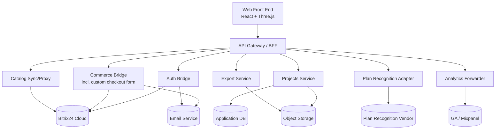

## Data Flow
For the primary loop (design-to-purchase), the front end loads catalog data from the Catalog Sync/Proxy's local cache (kept current via Bitrix24 webhooks + periodic reconciliation, not per-request Bitrix24 calls). Users place items into a project managed by the Projects Service, persisted to the Application DB/Object Storage. At checkout, the front end renders Commerce Bridge's custom checkout form; on submission, tokenized payment details (never raw card data — see security note below) are sent to the Commerce Bridge, which calls Bitrix24 Payment APIs directly and creates/updates the corresponding CRM deal. Order status and history are read live from Bitrix24 CRM via the Commerce Bridge for the "My Orders" page — no separate order database is maintained. A favorited item's displayed status (pending / used-in-project / ordered) is derived at read time by cross-referencing the favorites record in the Application DB against Projects Service data (to detect "used-in-project") and Bitrix24 CRM order data via the Commerce Bridge (to detect "ordered") — if neither match is found, the item is shown as "pending."

## Key Flow Sequence Diagrams

### UC-1: Register and log in
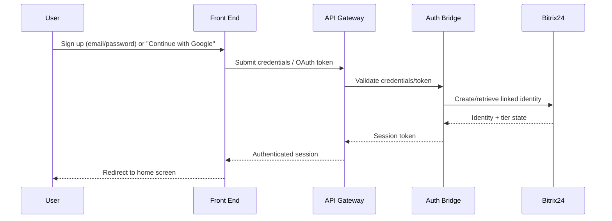

### UC-2: Create a design from an uploaded floor plan
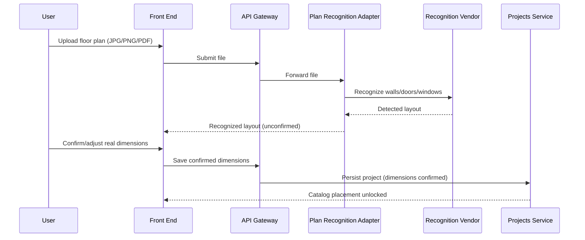

### UC-3: Start a design from a gallery template or public design
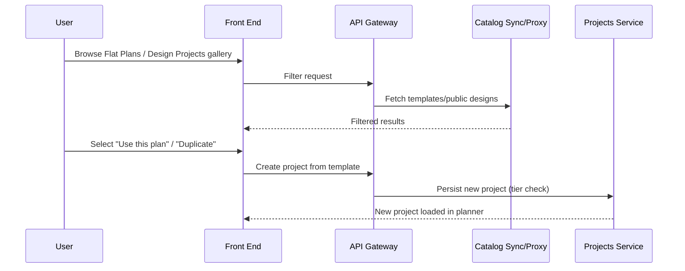

### UC-4: Furnish a design with catalog products
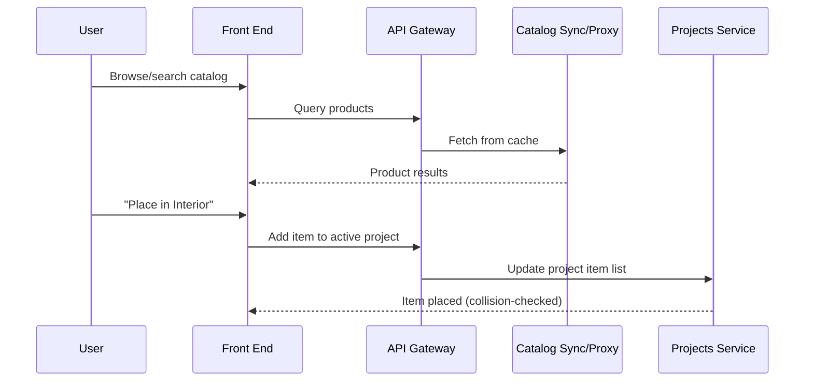

### UC-5: Save, duplicate, share, and publish a project
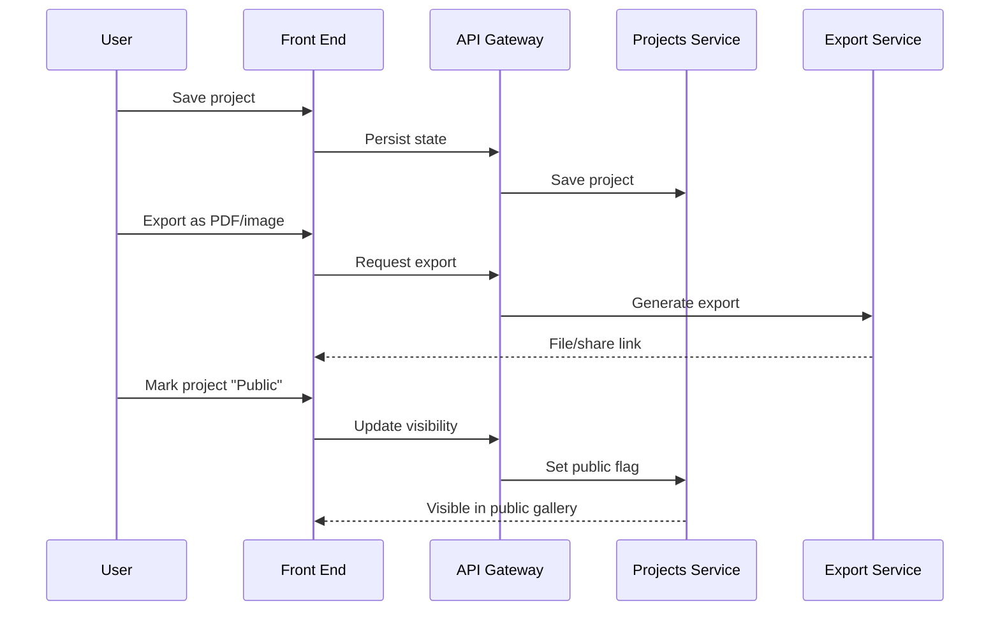

### UC-6: Purchase products/design packs (cart and checkout)
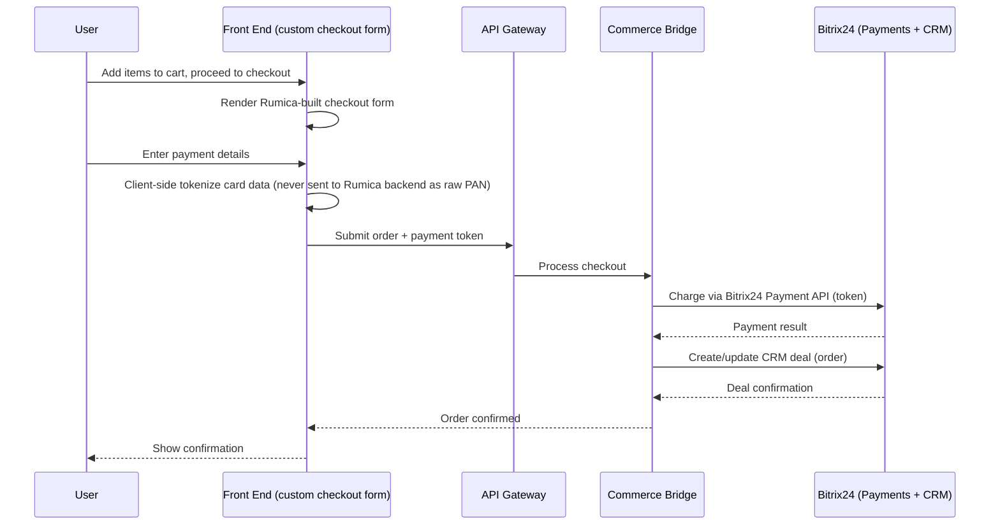

> **Note on this flow:** because Rumica's own front end renders the checkout form (rather than redirecting to a Bitrix24-hosted payment page), the payment card fields must use client-side tokenization (e.g., via the tokenization SDK of whichever payment provider is registered under Bitrix24's Payment module) so that raw card numbers never transit or persist in Rumica-owned code or infrastructure. This is a security/compliance consideration for the implementation team, not something to assume is automatically true of a custom form — it must be an explicit build requirement.

### UC-7: View order history ("My Orders")
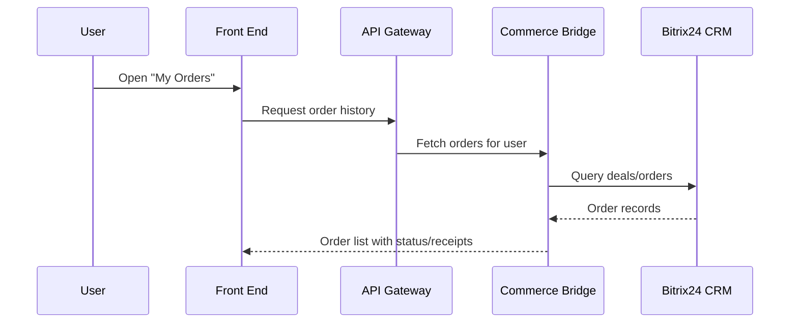

### UC-8: Subscribe to a paid tier
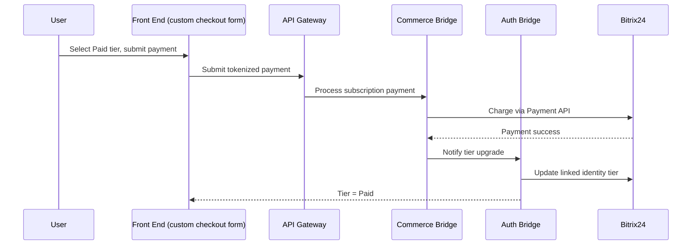

### UC-9: Manage catalog and users (Admin)
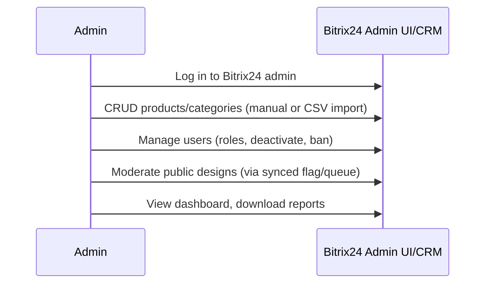
*(Admin actions occur primarily within Bitrix24 itself; the Catalog Sync/Proxy and Projects Service pick up resulting changes via webhook/reconciliation for the front end to reflect. No separate custom admin UI is built where Bitrix24's native admin covers the requirement.)*

## Integrations
| System | Protocol/Method | Data Exchanged | Notes |
|---|---|---|---|
| Bitrix24 Cloud (Standard Plan) | REST API + Webhooks, OAuth 2.0 | Identity, catalog, CRM deals/orders, payments | **Final:** Cloud, standard commercial plan. Moderate REST API rate limits — satisfied by webhook-driven catalog sync + periodic reconciliation, not live-proxying. No on-premise deployment is assumed anywhere in this architecture. |
| Bitrix24 Payment APIs | REST, direct server-to-server call from Commerce Bridge | Payment authorization/capture requests, tokenized payment method | **Final:** Rumica calls Bitrix24 Payment APIs directly from its own custom checkout form; the Bitrix24-hosted payment widget/page is NOT used. |
| Floor-plan recognition vendor (working assumption: CubiCasa) | REST API | Uploaded plan file → detected walls/doors/windows | Adapter-isolated pending vendor PoC per Vision & Scope |
| Google OAuth | OAuth 2.0 | Identity token | Sole social login provider in MVP |
| Google Analytics / Mixpanel | Client-side SDK and/or server-side event API | Usage events (project creation, item usage, planner engagement) | No PII beyond what these vendors' standard SDKs already collect |
| Email service (e.g., SendGrid/Mailgun-class provider) | REST/SMTP API | Registration, password recovery, order confirmation emails | Provider not yet named in Vision & Scope; treated as a standard transactional email integration |

## Non-Functional Requirements Mapping
The Vision & Scope document specifies no project-specific compliance, data-residency, or scale targets — only general best-practice placeholders (NFR-1 through NFR-5). This architecture satisfies them as follows:
- **NFR-1 (uptime, 99.5%+ target):** Achieved by relying on Bitrix24 Cloud's own SLA for CRM/catalog/payments, and standard cloud hosting with health checks/auto-restart for the thin custom services layer. No multi-region/active-active setup is warranted given no stated availability requirement beyond "standard."
- **NFR-2 (reasonable responsiveness):** The Catalog Sync/Proxy's local cache (rather than live-proxying every catalog read through Bitrix24) is the primary lever here — it keeps catalog page loads independent of Bitrix24 API latency/limits.
- **NFR-3 (standard security practices):** Encrypted transport (HTTPS) end to end; OAuth-based identity (Google + Bitrix24) rather than custom credential storage where possible; role-based access enforced natively by Bitrix24 for Admin functions. Additionally, because checkout is now a custom-built form (client-confirmed decision), client-side payment tokenization is called out explicitly as a required implementation practice so that raw card data never reaches Rumica-owned code — this is a superset addition to NFR-3 driven directly by the checkout decision, not a new requirement.
- **NFR-4 (backup/recovery):** Application DB and Object Storage use standard managed-service backup/retention (e.g., automated snapshots); Bitrix24-held data (catalog, CRM, payments) is backed up under Bitrix24's own operational practices, outside Rumica's responsibility.
- **NFR-5 (single-currency, single-language):** No architectural component introduces multi-currency or i18n infrastructure; this keeps the checkout, catalog, and CRM integration simpler than a localized build would require.
- **Scale assumption (explicit, per default-routing guidance):** No load/concurrency targets were given. This architecture defaults to a straightforward, non-distributed deployment of the bridge services (a small number of instances behind a load balancer) rather than a microservices/event-streaming buildout — sufficient for MVP traffic and straightforward to scale horizontally later if real usage data warrants it.

## Deployment View
```mermaid
graph TD
    subgraph Client
        Browser[User Browser]
    end

    subgraph Rumica Cloud Environment
        LB[Load Balancer / CDN]
        FEHost[Web Front End - static/SSR hosting]
        GWHost[API Gateway / BFF]
        Services[Bridge Services:<br/>Auth, Commerce, Catalog Sync,<br/>Projects, Plan Adapter, Export, Analytics Fwd]
        DB[(Application DB)]
        Storage[(Object Storage)]
    end

    subgraph Bitrix24 Cloud - SaaS, Standard Plan
        B24Core[Admin, CRM, Catalog, Payments, OAuth]
    end

    subgraph External Vendors
        PlanVendor[Plan Recognition Vendor]
        GA[GA / Mixpanel]
        EmailSvc[Email Service]
    end

    Browser --> LB
    LB --> FEHost
    FEHost --> GWHost
    GWHost --> Services
    Services --> DB
    Services --> Storage
    Services -->|REST/Webhooks, API-limit-aware| B24Core
    Services --> PlanVendor
    Services --> GA
    Services --> EmailSvc
```
Bitrix24 is consumed exclusively as a Cloud SaaS service (standard commercial plan, client-confirmed) — there is no on-premise Bitrix24 deployment in scope, and none of the sync/cache design assumes one. Rumica's own custom services are deployed as a small, horizontally-scalable set of stateless instances behind a load balancer; this is intentionally simple given no stated scale requirement.

## Key Architectural Decisions & Tradeoffs
- **Bitrix24-centric backend:** Admin, catalog, CRM, and payments live in Bitrix24 rather than being custom-built — gives up some flexibility/customization depth in exchange for materially lower build and maintenance cost (BR-4). The earlier Java/Spring Boot microservices exploration is confirmed superseded, not a parallel track.
- **Webhook + periodic reconciliation catalog sync (not live-proxying):** Chosen over calling Bitrix24 on every catalog read — trades near-real-time freshness (catalog updates land within the reconciliation window, not instantly) for materially lower Bitrix24 API load, which matters directly given the confirmed standard-plan API limits.
- **Custom Rumica-built checkout form (final, client-confirmed):** Chosen over the Bitrix24-hosted payment widget to give full UX/branding control end to end — trades a simpler, vendor-hosted redirect flow for additional custom-code surface (form validation, client-side tokenization, more careful security review) that the team must budget for explicitly.
- **No separate order database:** "My Orders" and order state are read live from Bitrix24 CRM rather than mirrored into Rumica's own DB — avoids a dual-write consistency problem, at the cost of order-history read latency being bounded by Bitrix24 API responsiveness (acceptable given no stated latency NFR).
- **Adapter boundary around floor-plan recognition:** Isolates the vendor choice (CubiCasa is a working assumption, not yet finalized per Vision & Scope) so a vendor swap after the PoC doesn't ripple into the rest of the system.
- **Relational Application DB (not NoSQL):** Projects/user-mapping/webhook-receipt data is structured and relationally shaped; no requirement points toward a document store or need for schema flexibility at this stage.
- **No microservices split for the bridge layer:** A small number of cohesive services behind a shared gateway is sufficient; splitting further would add operational overhead (service discovery, distributed tracing, more deployment units) with no stated scale/team driver to justify it.

## Cost & Complexity Notes
This remains a materially cheaper build than a fully custom backend (avoiding a parallel CRM/catalog/payment/admin implementation), which is the primary cost rationale for the Bitrix24-centric direction. One specific line item does need revisiting, however: the original commercial proposal's estimate table sizes **E-Commerce Features** at Front-end 2520 / Back-end 1440 / Testing 352 (USD), which reads as scoped for a simpler checkout integration (e.g., delegating to a Bitrix24-hosted payment page). The now-final decision to build a custom Rumica checkout form — including form validation, client-side payment tokenization, and the associated security review — is a larger build than a hosted-widget redirect and should prompt a re-estimate of that line item before the number is treated as final budget. This is flagged here as a cost/scope implication for the estimate owner, not resolved by this architecture document.

## Clarifying Questions
None. Both architecture-level questions from the prior round (Bitrix24 edition/plan; checkout implementation approach) are now resolved and reflected above as final decisions. No new architecture-level ambiguity was identified while incorporating them.
