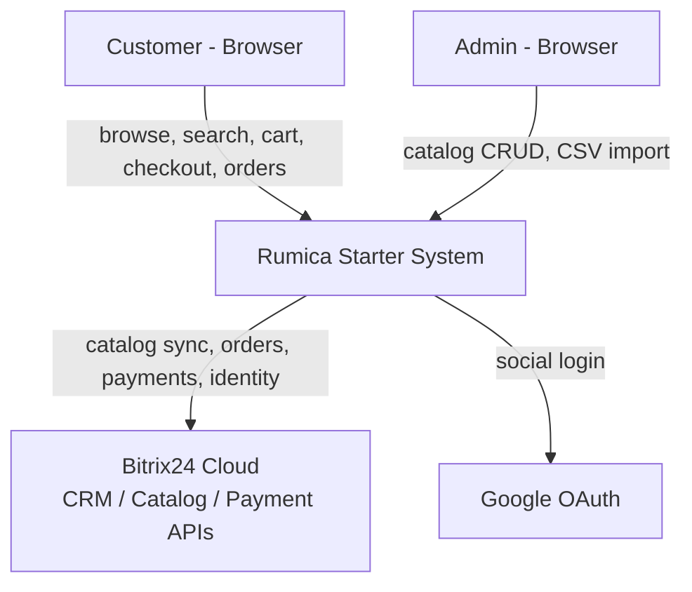
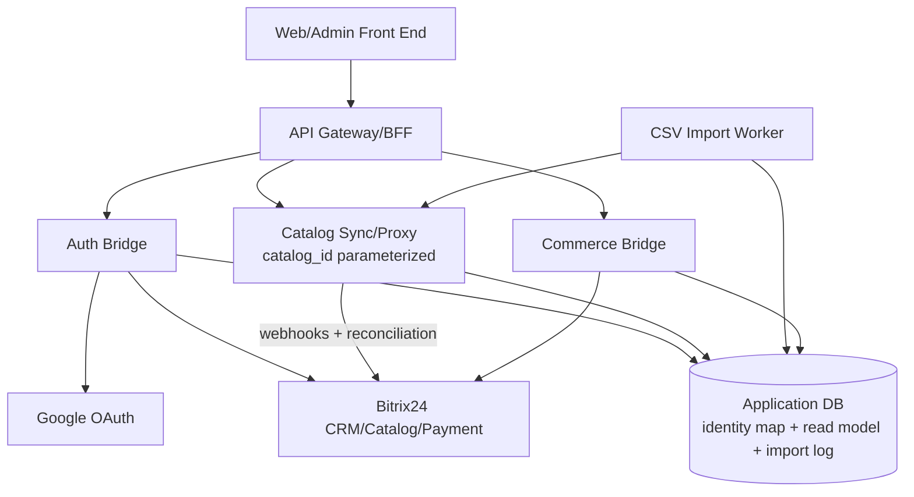
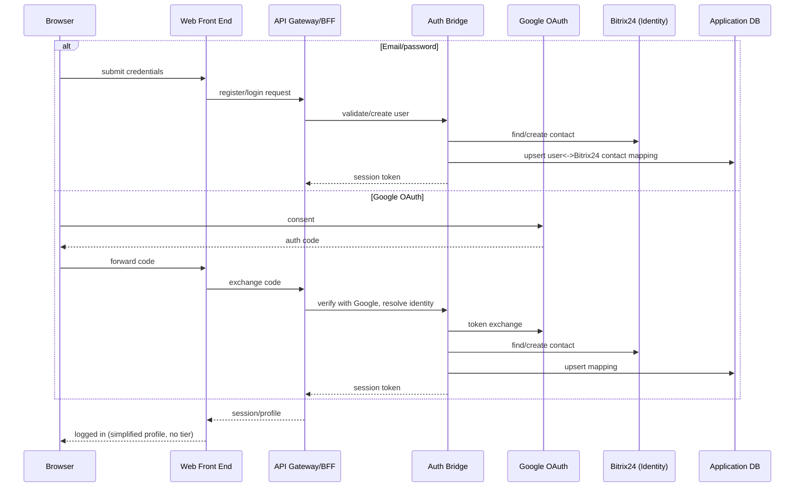
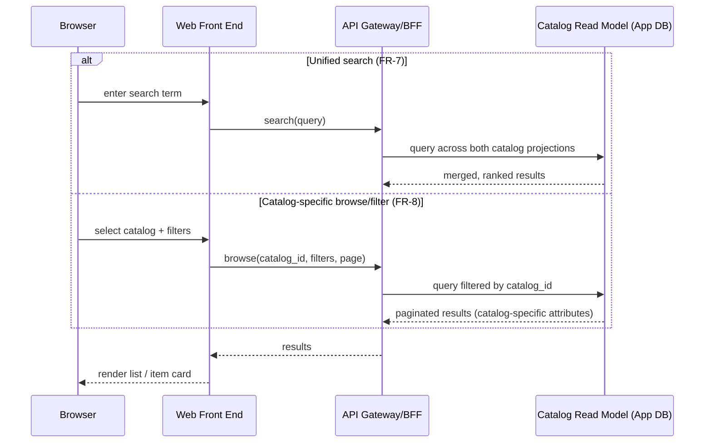
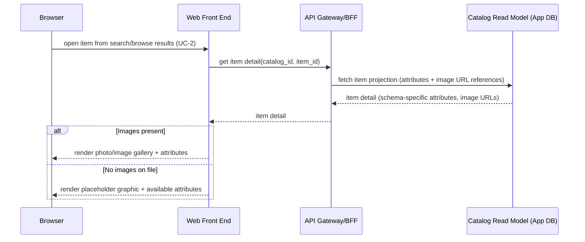
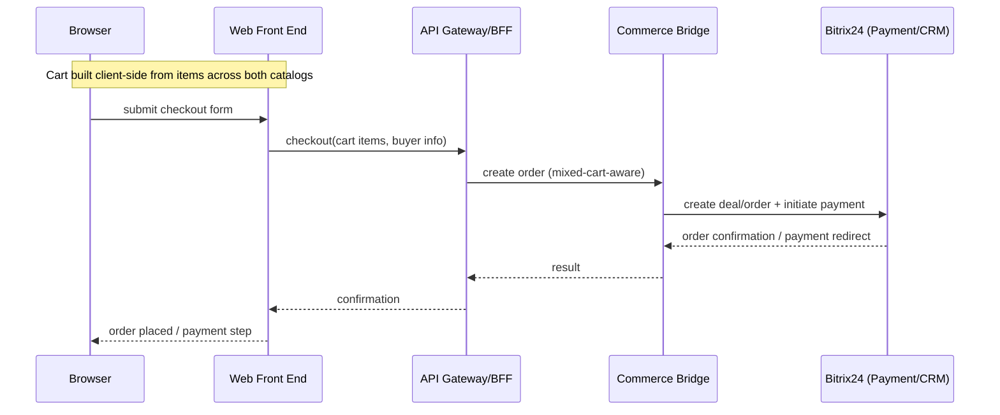
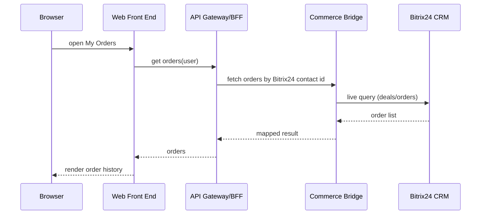
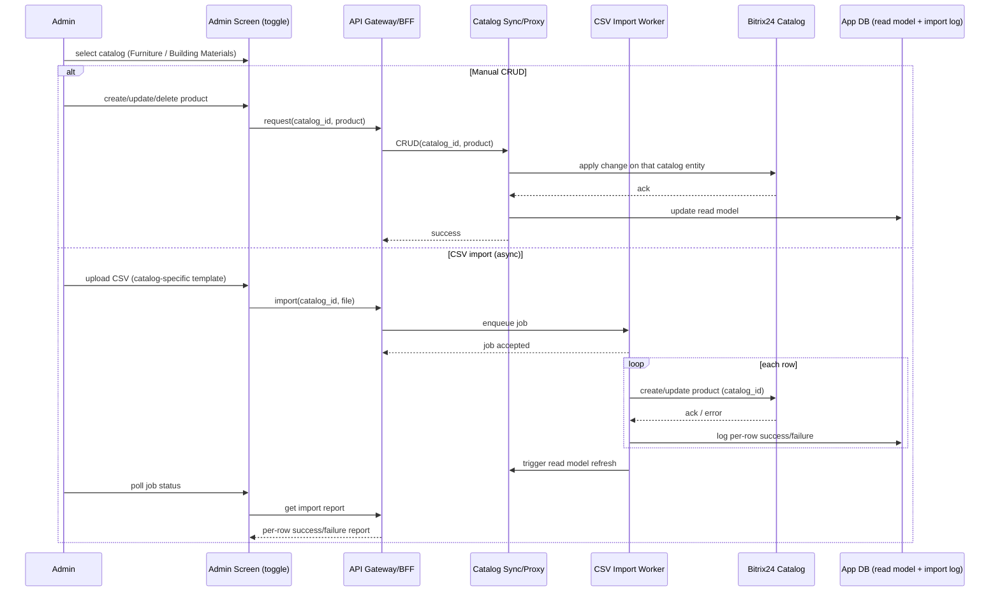
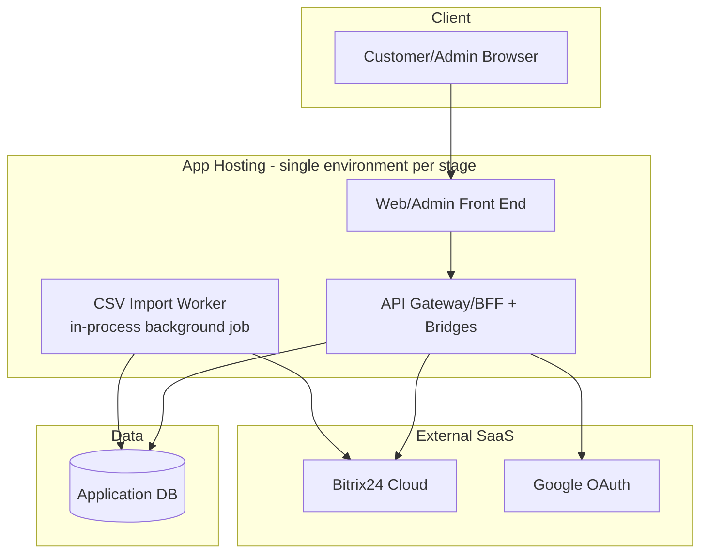

# System Architecture Specification — Rumica Starter (Phase 1 of Rumica)

## Overview
Rumica Starter is delivered as a **Bitrix24-centric modular monolith**, directly continuing the thin-bridge shape already finalized for the parent `artdecor-home-design` architecture — no new backend paradigm, no microservices split. The system is a single deployable application (Web/Admin Front End + API Gateway/BFF + Auth/Catalog/Commerce bridges + a lightweight async job worker) sitting in front of Bitrix24 Cloud, which remains the system of record for identity, catalog, and orders/payment (BR-4). The only structural addition Starter needs beyond the parent's shape is a small **Catalog Read Model** inside the existing Application DB, required specifically to satisfy unified search (FR-7) across two schema-independent Bitrix24 catalog entities without hitting Bitrix24 API rate limits on every browse/search request.

## Context Diagram

## Components
| Component | Responsibility | Technology | Why |
|---|---|---|---|
| Web/Admin Front End | Single React SPA: customer catalog browse/search/cart/checkout/orders + role-gated Admin "Catalog Management" screen (FR-9) | React | One app for both surfaces avoids building/hosting a second admin front end for a screen that is just a toggle + CRUD form — reuses parent's stack. |
| API Gateway/BFF | Single entry point; auth guard; request shaping/aggregation for the front end | Node/.NET (match parent stack) | Same role as in parent architecture; keeps front end decoupled from bridge internals. |
| Auth Bridge | Email/password + Google OAuth registration/login (FR-1, FR-2); session issuance (FR-3); simplified profile (FR-4) | Server-side module | Reuses parent's Auth Bridge pattern against Bitrix24 identity (contacts); Starter just omits tier fields. |
| Catalog Sync/Proxy (parameterized) | Webhook-driven + periodic reconciliation sync between Bitrix24's two catalog entities (Furniture, Building Materials) and the Catalog Read Model; passthrough for manual CRUD (FR-9) | Server-side module, `catalog_id`-parameterized | One parameterized service instead of two parallel pipelines — see Key Decisions. |
| CSV Import Worker | Async/batch processing of catalog-specific CSV templates (FR-10); per-row success/failure logging | Background job (DB-backed queue, in-process worker) | Satisfies NFR-1's "non-blocking" requirement without introducing a message broker the scale doesn't justify. |
| Catalog Read Model | Denormalized, indexed projection of both catalogs (common fields for unified search + full attributes and image-gallery references for catalog-specific detail/filter and the item card, FR-14/UC-6) | Table(s) in Application DB, full-text/indexed columns | The mechanism that makes FR-7 (unified search) possible when the two catalogs are separate Bitrix24 entities — see Key Decisions. Also the direct source for the item card (FR-14/UC-6): images are synced as URL references to Bitrix24-hosted files, not re-stored, so no Object Storage is needed for this. |
| Commerce Bridge | Single checkout flow (FR-12): mixed-cart-aware order submission → Bitrix24 Payment APIs; order/deal creation in Bitrix24 CRM | Server-side module | Starter has only one checkout path (unlike parent's two), so this is a simplified subset of the parent's Commerce Bridge. |
| Application DB | User↔Bitrix24 identity mapping; Catalog Read Model; CSV import job/log status | Relational DB (e.g. PostgreSQL) | Same DB the parent already uses; Starter just needs a narrower slice of it (no favorites/projects data yet). |

Explicitly **not included** (per parent architecture guidance and Starter's scope): Projects Service, Plan Recognition Adapter, Export Service, Analytics Forwarder, Object Storage (Bitrix24 already stores catalog product images; CSV templates reference image URLs, nothing new to store).

## Component Diagram

## Data Flow
Bitrix24 remains the source of truth for catalog data, identity, and orders. The Catalog Sync/Proxy keeps the Catalog Read Model in the Application DB in near-real-time sync via Bitrix24 webhooks, backed by periodic reconciliation (the parent's established mitigation for Bitrix24 API rate limits). All customer-facing reads (unified search, catalog-specific browse/filter, product detail) are served from this read model rather than hitting Bitrix24 live on every request. Writes (admin CRUD, CSV import rows) go to Bitrix24 first, then the read model is updated by the same sync mechanism. Checkout and "My Orders" are the two flows that intentionally bypass the read model and talk to Bitrix24 CRM/Payment APIs live, since orders/payment must reflect Bitrix24's authoritative state.

## Key Flow Sequence Diagrams

### UC-1 Register / Login

### UC-2 Browse and Search Catalogs

### UC-6 View Item Card (Photos and Details)

No new component is introduced for this flow: the item card is served entirely from the same Catalog Read Model that already backs UC-2, since images are stored as URL references synced from Bitrix24 rather than in a separate media store.

### UC-3 Purchase Individual Products (Mixed Cart)

### UC-4 View My Orders

### UC-5 Admin Catalog Management

## Integrations
| System | Protocol/Method | Data Exchanged | Notes |
|---|---|---|---|
| Bitrix24 CRM/Catalog | REST API (webhooks + polling reconciliation) | Product data for both catalogs, orders/deals, contacts | Two catalog entities (Furniture, Building Materials); Bitrix24 API rate limits mean webhook-first, reconciliation as backstop (per parent finding). |
| Bitrix24 Payment APIs | REST API | Checkout/payment creation, payment status | Single checkout path only (Starter has no subscription/dual-path). |
| Google OAuth | OAuth 2.0 | Identity token, email, profile | Login only; no other Google services used. |

## Non-Functional Requirements Mapping
- **NFR-1 (medium scale, low thousands SKUs per catalog):** Browse/search/filter is served from the indexed Catalog Read Model (not live Bitrix24 calls), satisfying "indexed filtering + pagination at this scale" without needing a dedicated search engine.
- **NFR-1 (CSV import batch/async, non-blocking):** Handled by the CSV Import Worker as a background job with per-row status logged to the Application DB; admin polls for the report rather than blocking on the request.
- **No other NFRs specified (per V&S):** Default assumptions made for this Starter architecture, consistent with the parent's Bitrix24-centric posture:
  - Single-region deployment is sufficient; no stated availability/latency SLA beyond "usable at low-thousands-SKU scale."
  - Security posture matches the parent's standard Bitrix24 auth/commerce baseline (TLS in transit, Bitrix24-managed payment handling, no additional compliance regime called out).
  - No accessibility or localization work beyond standard browser-default behavior — not requested, not built.
  - These are noted explicitly per this pipeline's convention of defaulting to the simplest architecture and flagging the assumption, rather than inventing formal NFRs.

## Deployment View

Dev/Staging/Prod are the same topology repeated per environment (no additional networking complexity needed at this scale); no message broker or container-orchestration layer is introduced beyond what the parent already assumes.

## Key Architectural Decisions & Tradeoffs
- **Two separate Bitrix24 catalog entities (not one catalog with a type field):** Chosen because Furniture and Building Materials have genuinely independent attribute schemas (client-confirmed). Bitrix24's catalog module supports multiple catalogs, each with its own product property set — this maps 1:1 onto the requirement. A single catalog keyed by a type field would force every product to carry a sparse union of both schemas, breaking admin CRUD forms, CSV templates, and validation. The tradeoff given up is a slightly more complex sync layer (two entities to track) — acceptable and handled by parameterization below.
- **One parameterized Catalog Sync/Proxy (`catalog_id` param) instead of two parallel pipelines:** The sync logic (webhook handling, reconciliation, CRUD passthrough, import row processing) is identical between the two catalogs; only the schema mapping differs. Parameterizing keeps one codebase/one deployable to maintain instead of two, at the cost of a config-driven schema map per catalog — a reasonable tradeoff at two catalogs, and it stays viable if a third catalog is ever added later.
- **Catalog Read Model to satisfy unified search (FR-7):** Because the two catalogs are stored as separate Bitrix24 entities, a query spanning both cannot be done as a single live Bitrix24 API call. Introducing a merged, indexed projection in the existing Application DB (rather than a dedicated search engine like Elasticsearch) is the minimum addition that makes FR-7 possible while also satisfying NFR-1's indexed-filtering requirement for FR-8's catalog-specific browsing. The tradeoff is eventual consistency between Bitrix24 and the read model (bounded by webhook latency + reconciliation interval), which is acceptable for a catalog browse/search use case.
- **Shared Web/Admin Front End instead of a separate admin app:** FR-9 is a single toggle screen with manual CRUD and CSV import — not a full admin panel. Building a second front end for this would add deployment and auth-boundary overhead with no functional benefit at Starter's scope.
- **Client-side cart, no dedicated cart-persistence service:** The V&S does not require cross-device/cross-session cart persistence, so the mixed cart (FR-11) is held client-side and submitted whole at checkout. This avoids a cart microservice/table the requirements don't call for; if cross-device cart persistence is later required, this would need revisiting (flagged, not built preemptively).
- **DB-backed job queue for CSV import instead of a message broker:** At low-thousands-SKU-per-catalog batch sizes, a simple DB-backed queue processed by an in-process worker meets the "non-blocking" requirement without the operational cost of Kafka/RabbitMQ/etc.

## Cost & Complexity Notes
The only real addition Starter makes over the parent's already-finalized shape is the Catalog Read Model plus its sync parameterization — everything else is a direct subset (single checkout path, no Projects/Plan Recognition/Export/Analytics/Object Storage components, one shared front end). The alternative of introducing a dedicated search engine or splitting into two independent sync microservices would materially raise operational cost (extra service to run, monitor, and deploy) without being justified by the stated scale (low thousands of SKUs per catalog) or by any requirement in the V&S — so both were rejected in favor of extending the existing Application DB and parameterizing the existing sync component.

## Clarifying Questions
None.
