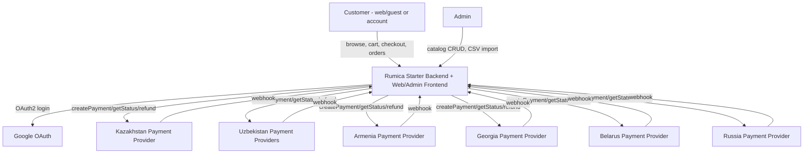
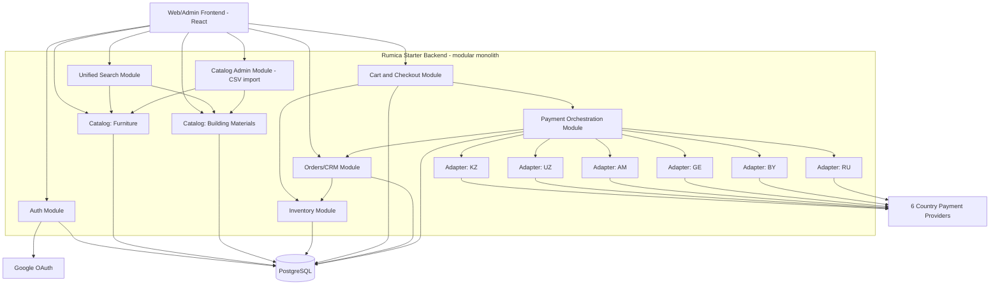
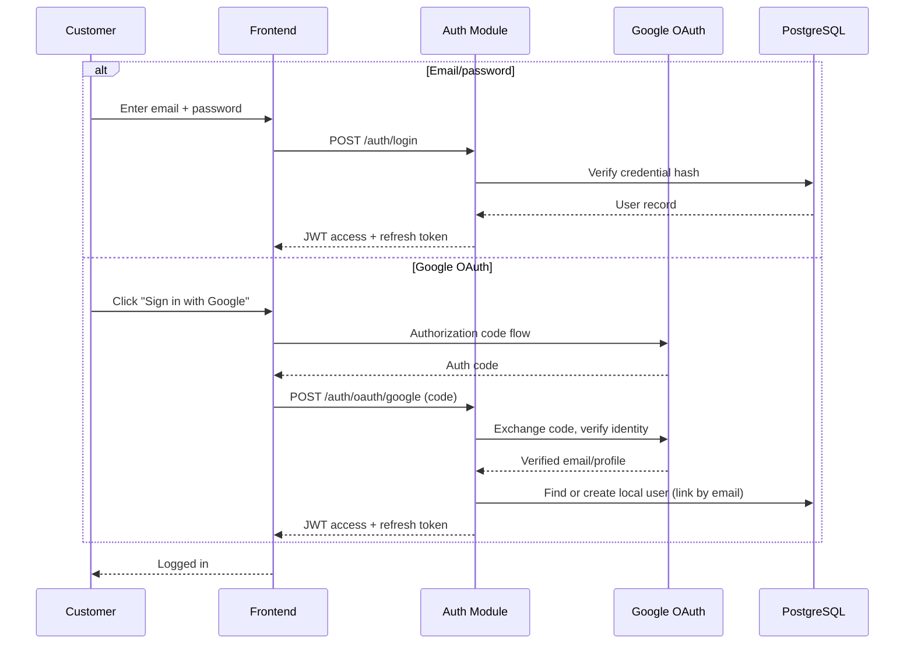
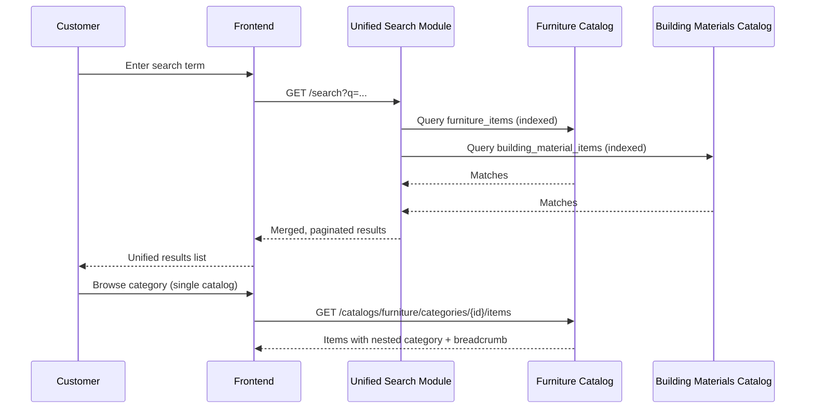
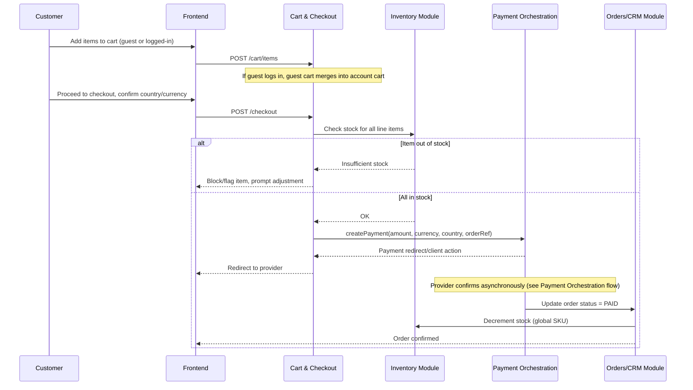
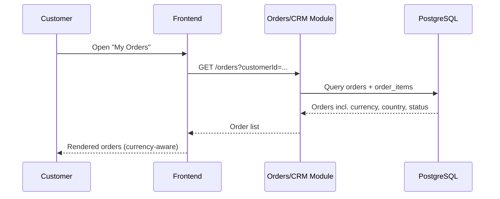
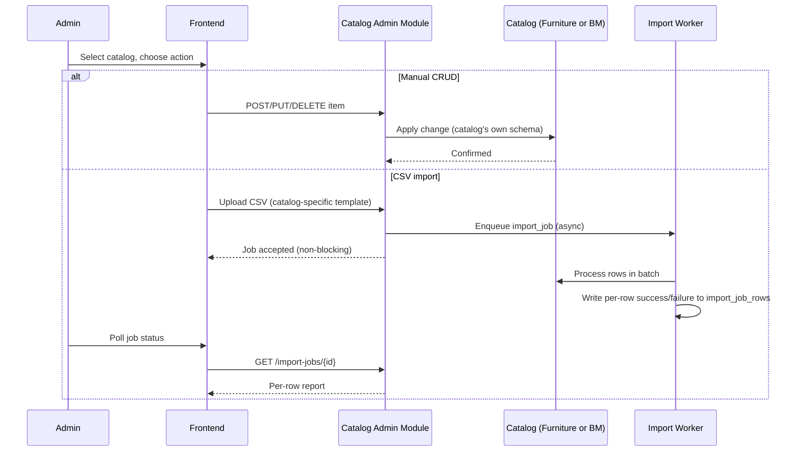
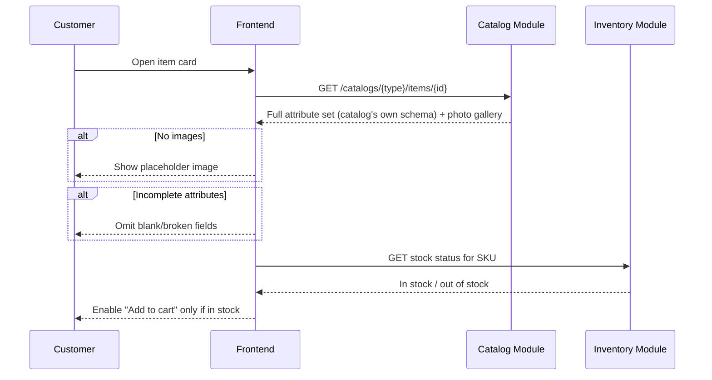
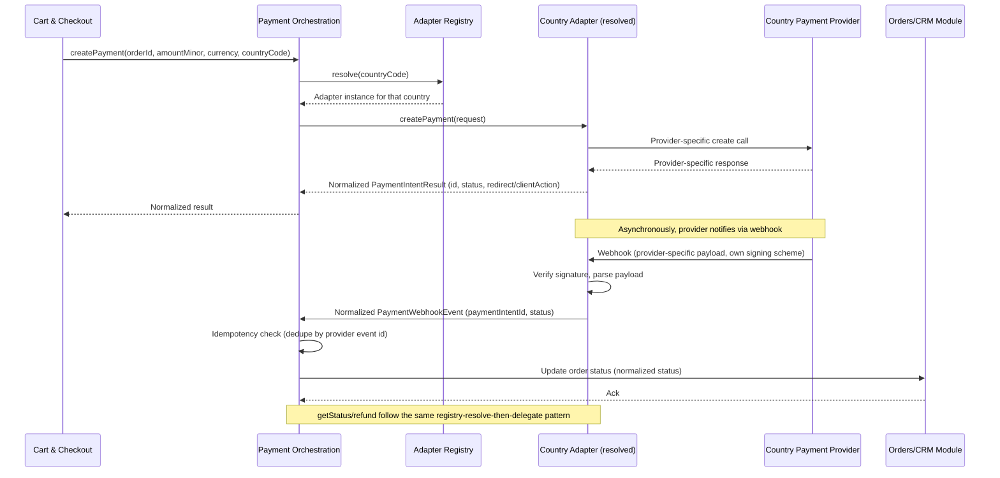
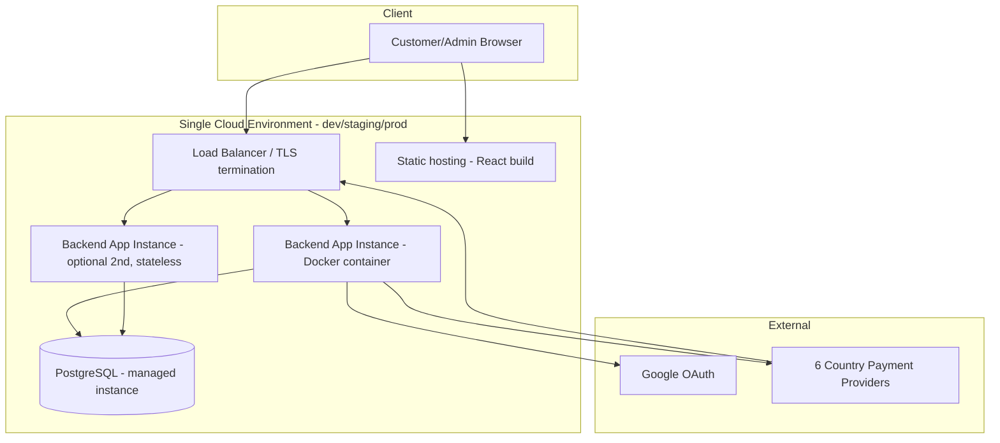

# System Architecture Specification — Rumica Starter (Phase 1)

## Overview
Rumica Starter is now a **fully custom-built modular monolith** (single deployable backend application, internally organized into clearly-bounded modules) backed by PostgreSQL, with a React SPA front end for both customer and admin use. There is no Bitrix24 dependency anywhere. The one deliberately isolated exception to the monolith's internal cohesion is the **Payment Orchestration module**, which is built as a strict plugin boundary (one internal interface, six independently swappable country adapters) — because all six regional payment vendors are explicitly working assumptions pending PoC/validation, not because the traffic or team size demands service separation. Given no stated concurrency/throughput requirement beyond "medium scale, low thousands SKUs per catalog" (NFR-1), a single modular monolith is the simplest architecture that satisfies every FR/NFR while being straightforward to scale horizontally (stateless app tier) or to carve a module out into its own service later if a specific one (most likely Payment Orchestration) outgrows the monolith.

## Context Diagram

## Components
| Component | Responsibility | Technology | Why |
|---|---|---|---|
| Web/Admin Frontend | Customer storefront (catalogs, search, cart, checkout, orders) + Admin catalog management UI | React SPA | Retained from prior architecture — no reason to change; single SPA serves both roles via route-level auth checks |
| Auth Module | Own credential store (hashed passwords), Google OAuth2 federation, JWT access/refresh token issuance, session lifecycle (FR-1,2,3) | Spring Security + OAuth2 client, JWT | Stateless tokens keep the app tier scale-out-ready later without a shared session store now |
| Catalog Module (Furniture submodule) | Furniture catalog: own attribute schema, browse/filter, nested categories + breadcrumbs, item card data (FR-5,8,14) | Spring Boot service module + PostgreSQL table `furniture_items` (typed columns + JSONB for schema-specific attributes) | See "Two catalogs, one design" decision below |
| Catalog Module (Building Materials submodule) | Building Materials catalog: independent attribute schema, browse/filter, nested categories + breadcrumbs, item card data (FR-6,8,14) | Spring Boot service module + PostgreSQL table `building_material_items` | Same reasoning as Furniture submodule; schema never merged with Furniture's |
| Unified Search Module | Cross-catalog search: queries both item tables, merges/ranks/paginates at the application layer (FR-7) | PostgreSQL full-text search (`tsvector`/GIN index) on each item table, application-side merge | Full-text index is enough at "low thousands SKUs per catalog"; a search engine (Elasticsearch/OpenSearch) would be unjustified operational overhead at this scale |
| Inventory Module | Single global stock quantity per SKU, decrement-on-paid-order, out-of-stock flag/block (FR-15) | PostgreSQL table `inventory` keyed by global SKU, row-level locking on decrement | Deliberately catalog-agnostic — see reconciliation note below |
| Catalog Admin Module | Toggle-catalog CRUD screen, two CSV templates, async batch import, per-row success/failure reporting, Admin-only (FR-9,10) | Spring Boot module + `import_jobs`/`import_job_rows` tables, in-process async worker pool | DB-backed job table is sufficient at this import volume; avoids standing up a message broker |
| Cart & Checkout Module | Mixed-catalog cart, anonymous/guest cart, guest→account merge on login, country/currency context capture, checkout orchestration trigger (FR-11,12,16) | Spring Boot module + `cart`/`cart_item` tables | Cart persisted in Postgres (not Redis) — no stated latency requirement that justifies an extra moving part |
| Orders/CRM Module | System of record for orders/customers, order status state machine, "My Orders" source (FR-13) | Spring Boot module + `order`/`order_item`/`customer` tables | Replaces Bitrix24 CRM entirely — no external CRM dependency remains |
| Payment Orchestration Module | Internal `createPayment/getStatus/refund/webhook` interface, country→adapter registry, 6 country adapters, webhook normalization (FR-17) | Spring Boot module, one package per country adapter, Spring bean map keyed by ISO country code | Core new design element — detailed below |
| PostgreSQL Database | System of record for all modules above (single schema, module-owned tables) | PostgreSQL 15+ | Relational integrity needed for stock decrement transactions, FK-consistent orders/cart/catalog; JSONB gives per-catalog schema flexibility without a second database technology |

## Component Diagram

## Data Flow
For the primary use case (purchase): the Frontend collects cart contents and the buyer's selected country/currency context on the Cart & Checkout Module, which persists a cart snapshot (line items, unit prices in that country's currency, currency code) in PostgreSQL. On checkout submission, Cart & Checkout calls the Payment Orchestration Module's `createPayment`, passing amount (minor units), currency code, country code and an internal order reference; the orchestrator resolves the matching country adapter via its registry, and the adapter calls the external provider, returning a redirect/client-action reference to the Frontend. The provider later calls back through that same adapter's webhook endpoint; the adapter verifies the signature and parses the provider-specific payload, then hands a normalized status event to the orchestrator, which updates the Orders/CRM Module's order status. On the first transition to a "paid/captured" status, the Orders module calls the Inventory Module to decrement the SKU's single global stock count within the same transaction that finalizes the order.

## Key Flow Sequence Diagrams

### UC-1 Register/Login

### UC-2 Browse and Search Catalogs

### UC-3 Purchase Individual Products

### UC-4 View My Orders

### UC-5 Admin Catalog Management

### UC-6 View Item Card (Photos and Details)

### Payment Orchestration & Country Routing (new flow, underpins UC-3)

## Integrations
| System | Protocol/Method | Data Exchanged | Notes |
|---|---|---|---|
| Google OAuth | OAuth2 Authorization Code flow | Verified email, profile, auth tokens | Used only for identity federation into local user store; no data sync back to Google |
| Kazakhstan payment provider (Kaspi Pay + fallback card acquiring) | Provider-specific REST API + webhook | Payment create request, status, refund, webhook notification | **Working assumption pending PoC** — built behind adapter interface so provider can change without touching other components |
| Uzbekistan payment providers (Payme, Click, offered in parallel) | Provider-specific REST APIs + webhooks | Same as above; adapter may itself dispatch to whichever of the two the customer selects | **Working assumption pending PoC**; sub-selection logic contained entirely inside the UZ adapter |
| Armenia payment provider (Ameriabank vPOS or VPOS.am — undecided) | Provider-specific REST API + webhook | Same as above | **Working assumption pending PoC/validation of which vendor** |
| Georgia payment provider (TBC E-Commerce or Bank of Georgia — undecided) | Provider-specific REST API + webhook | Same as above | **Working assumption pending PoC/validation of which vendor** |
| Belarus payment provider (bePaid — ЕРИП + cards) | Provider-specific REST API + webhook | Same as above | **Working assumption pending PoC** |
| Russia payment provider (ЮKassa/CloudPayments) | Provider-specific REST API + webhook | Same as above | **Working assumption**, additionally contingent on continued legal presence in Russia — a business/legal condition the architecture cannot mitigate, only isolate behind the same adapter boundary |

## Non-Functional Requirements Mapping
- **NFR-1 (medium scale, indexed/paginated, async CSV):** Each catalog's item table is indexed on category and full-text search columns; all browse/search/list endpoints are paginated by default. CSV import runs on an in-process async worker pool against a `import_jobs` table so uploads never block the admin's request thread; per-row outcomes are written to `import_job_rows` for the reporting requirement.
- **NFR-2 (multi-currency data integrity):** Every monetary column across `cart_item`, `order_item`, `order`, and payment records is a `(amount_minor_units BIGINT, currency_code CHAR(3))` pair — never a bare float/decimal. Per-SKU pricing is stored in a dedicated `product_price(sku, country_code, currency_code, amount_minor_units)` table, one row per country, rather than a single price column on the catalog item — this keeps the "6 local currencies, no reference currency" rule structurally enforced rather than convention-based. No query, report, or aggregation in this design sums or compares amounts across different currency codes; any future cross-currency reporting (explicitly out of scope) would need a separate conversion/reporting layer, not a change to this data model.
- **NFR-3 (adapter swap resilience):** Satisfied by construction, not just asserted — see "Payment Orchestration Layer" decision below. Each country's adapter is its own package with its own provider client, its own webhook-signature verification, and its own secrets/config; the orchestrator, checkout UI, order flow, and the other five adapters depend only on the shared internal interface (`createPayment/getStatus/refund/webhook` + the normalized status enum), never on any adapter's internals. Replacing e.g. the Armenia adapter means writing a new class that implements the same interface and re-pointing the registry entry for `AM` — no other module's code changes.

## Deployment View

Assumption (no load/traffic figures were given in the Vision & Scope): a single containerized backend instance behind a load balancer is sufficient at launch; the app is stateless (JWT-based auth, no in-memory session/cart state), so adding a second instance is a scaling operation, not a redesign.

## Key Architectural Decisions & Tradeoffs
- **Modular monolith over microservices:** Chosen because nothing in the confirmed FR/NFR set (medium catalog scale, no stated concurrency target) requires independent deployability or independent scaling per module. Tradeoff given up: can't scale or deploy, say, the Catalog module independently of Cart & Checkout. Mitigated by keeping module boundaries clean in code (each module owns its own tables and exposes its own internal API), so any one module — most plausibly Payment Orchestration if a country's volume or compliance needs grow — can be extracted into its own service later without a rewrite.
- **In-house adapters over a third-party multi-country payment aggregator:** A payment-orchestration SaaS was considered and rejected. Five of the six target vendors (Kaspi Pay, Payme, Click, bePaid, ЮKassa/CloudPayments) are regional/local providers with limited or no coverage by global aggregators, and the vendor choice per country is itself explicitly unproven pending PoC. Adding a second unvalidated vendor layer (the aggregator) on top of six unvalidated regional ones would compound risk instead of reducing it — thin in-house adapters behind one internal interface give full control over exactly what NFR-3 requires (isolated swap-out) without a dependency on an aggregator's own roadmap or regional coverage.
- **Registry/strategy pattern for country routing over hardcoded branching:** The `country_code → adapter` resolution is a configuration-driven map (one Spring bean per adapter, registered under its ISO country code), not an `if/else` chain in checkout logic. This is what makes "swap within weeks" concrete: adding, removing, or replacing a country's adapter is a registration change plus a new class, never a change to `Cart & Checkout` or `Orders/CRM`.
- **Generic payment result shape (redirect/client-action) instead of modeling one provider's flow:** `createPayment` returns a minimal, provider-agnostic result (status + optional redirect URL/client action) rather than assuming any one provider's specific flow (e.g., 3-D Secure redirect) as the norm. This avoids baking a Kaspi-Pay-shaped or ЮKassa-shaped assumption into the checkout UI that would break if the eventual PoC-selected vendor for that country works differently.
- **Single shared `inventory` table over a stock column per catalog item table:** FR-6 (independent per-catalog attribute schemas) and FR-15 (one global stock pool) are different axes and are deliberately kept in different tables — item tables (`furniture_items`, `building_material_items`) diverge freely on attributes, while a single `inventory(sku, stock_qty)` table, keyed by a global SKU shared across both catalogs, is the only place stock is read, locked, and decremented. This means FR-15's logic never needs to know which catalog a SKU belongs to.
- **PostgreSQL with JSONB for catalog-specific attributes over EAV or two separate databases:** Keeps referential integrity (SKU → inventory, item → category, order → order_item) in one relational store while still letting each catalog's attribute set diverge; application-layer schema validation per catalog compensates for JSONB's looser typing.
- **JWT stateless auth over server-side sessions:** Simplifies later horizontal scaling of the app tier; tradeoff is coarser token revocation, mitigated with short-lived access tokens + refresh token rotation.
- **DB-backed async job queue for CSV import over a message broker:** Satisfies "non-blocking, per-row reporting" without operating Kafka/RabbitMQ; revisit only if import volume or the number of async workflows grows enough to justify a broker.
- **No separate API Gateway/BFF:** The backend already exposes one coherent REST API consumed by both the customer and admin surfaces of the same SPA; a gateway would add a hop with no current multi-client or multi-backend need to justify it.

## Cost & Complexity Notes
The dominant cost driver in this rework is the six-country payment layer, not the rest of the backend — and that cost is inherent to the requirement (six real regional payment ecosystems, each unproven), not to an architectural choice. Everywhere else, this design deliberately stays boring: one relational database, one deployable application, no message broker, no search engine, no API gateway, no session store. The only place structure was added beyond the "simplest possible" baseline is the payment adapter boundary, and that structure is justified directly by NFR-3 and by the explicit "working assumption, pending PoC" status of every one of the six vendors — the adapter isolation is what makes it cheap to be wrong about any single country's vendor choice.

## Clarifying Questions
None — all points required by this rework (dropping Bitrix24 entirely, custom backend module shape, payment orchestration design, multi-currency data model, and the catalog-schema-vs-global-stock reconciliation) are resolved above using the confirmed Vision & Scope content and reasonable, explicitly-stated defaults (single-instance deployment scale, explicit country/currency selection captured on the cart) rather than open items.
