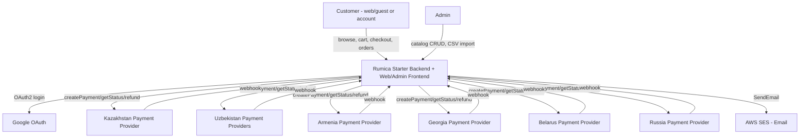
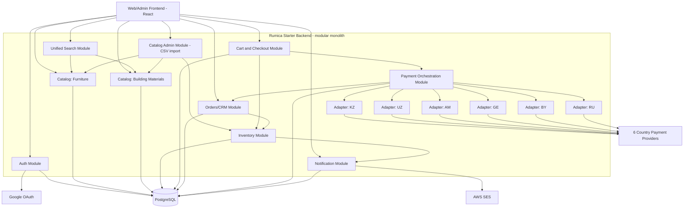
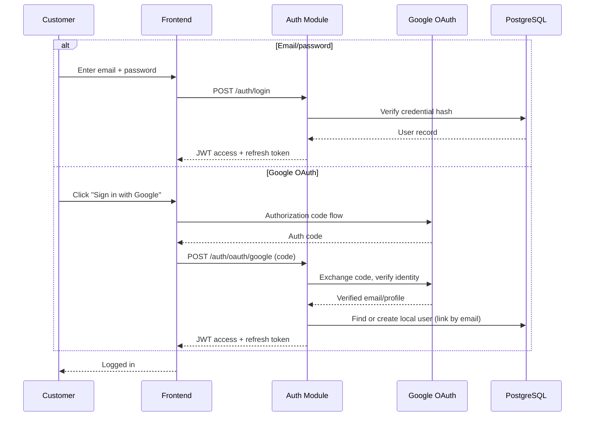
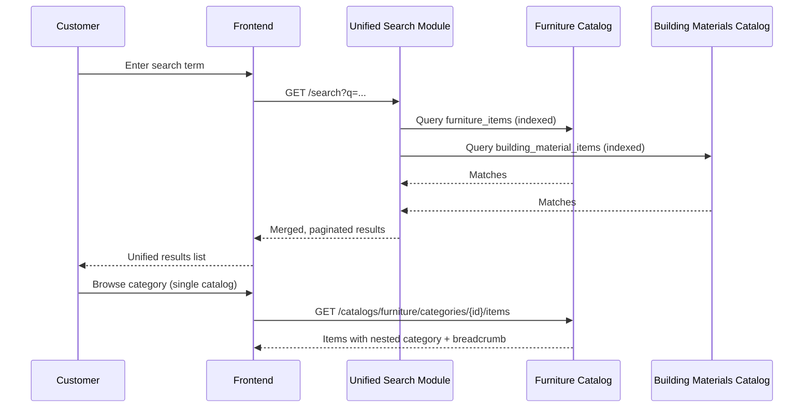
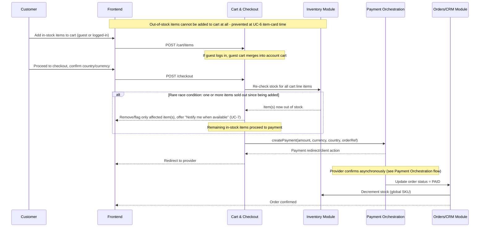
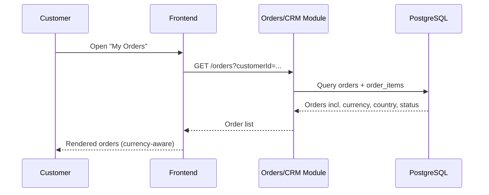
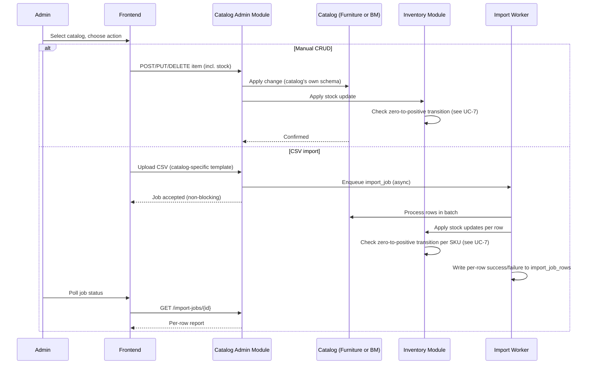
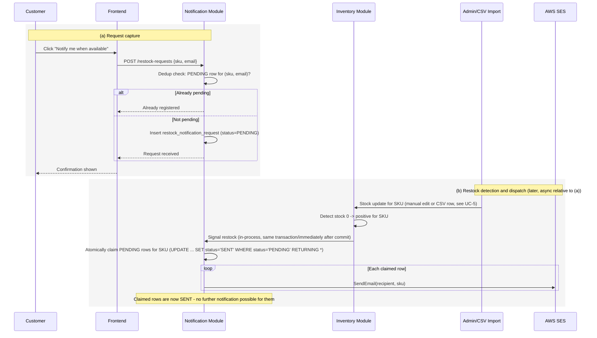
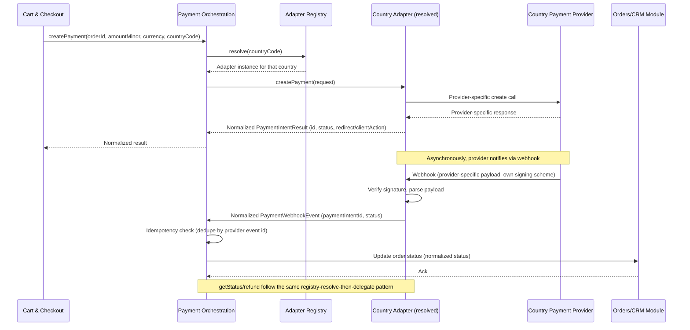
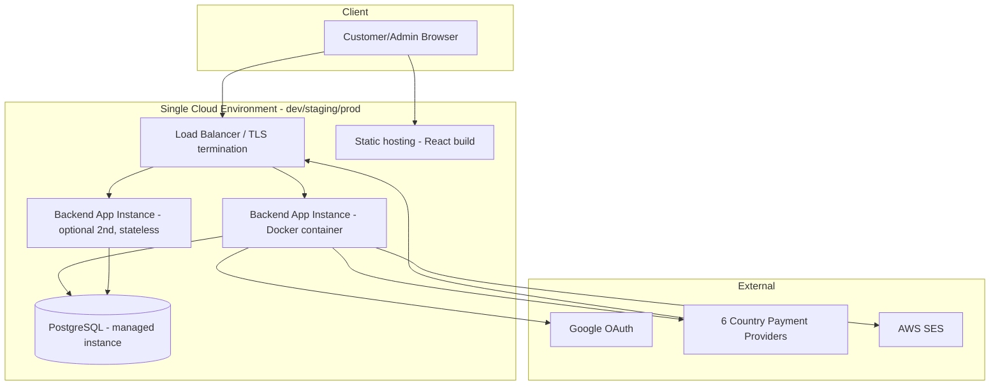

# System Architecture Specification — Rumica Starter (Phase 1)

## Overview
Rumica Starter is now a fully custom-built modular monolith (single deployable backend application, internally organized into clearly-bounded modules) backed by PostgreSQL, with a React SPA front end for both customer and admin use. There is no Bitrix24 dependency anywhere. The one deliberately isolated exception to the monolith's internal cohesion is the Payment Orchestration module, which is built as a strict plugin boundary (one internal interface, six independently swappable country adapters) — because all six regional payment vendors are explicitly working assumptions pending PoC/validation, not because the traffic or team size demands service separation. Given no stated concurrency/throughput requirement beyond "medium scale, low thousands SKUs per catalog" (NFR-1), a single modular monolith is the simplest architecture that satisfies every FR/NFR while being straightforward to scale horizontally (stateless app tier) or to carve a module out into its own service later if a specific one (most likely Payment Orchestration) outgrows the monolith.

## Context Diagram


## Components
| Component | Responsibility | Technology | Why |
|---|---|---|---|
| Web/Admin Frontend | Customer storefront (catalogs, search, cart, checkout, orders) + Admin catalog management UI | React SPA | Retained — single SPA serves both roles via route-level auth checks |
| Auth Module | Own credential store (hashed passwords), Google OAuth2 federation, JWT access/refresh token issuance, session lifecycle (FR-1,2,3) | Spring Security + OAuth2 client, JWT | Stateless tokens keep the app tier scale-out-ready without a shared session store |
| Catalog Module (Furniture submodule) | Furniture catalog: own attribute schema, browse/filter, nested categories + breadcrumbs, item card data (FR-5,8,14) | Spring Boot service module + PostgreSQL table `furniture_items` (typed columns + JSONB) | Own table keeps schema fully independent of Building Materials |
| Catalog Module (Building Materials submodule) | Building Materials catalog: independent attribute schema, browse/filter, nested categories + breadcrumbs, item card data (FR-6,8,14) | Spring Boot service module + PostgreSQL table `building_material_items` | Same reasoning as Furniture submodule; schema never merged |
| Unified Search Module | Cross-catalog search: queries both item tables, merges/ranks/paginates at the application layer (FR-7) | PostgreSQL full-text search (`tsvector`/GIN index) on each item table, application-side merge | Sufficient at "low thousands SKUs per catalog"; a search engine would be unjustified overhead |
| Inventory Module | Single global stock quantity per SKU, decrement-on-paid-order, out-of-stock flag/block (FR-15); also detects zero→positive stock transitions on every update and signals the Notification Module in-process (FR-18) | PostgreSQL table `inventory` keyed by global SKU, row-level locking on decrement | Deliberately catalog-agnostic; now doubles as the restock-detection trigger point since it is the sole writer of stock state |
| Catalog Admin Module | Toggle-catalog CRUD screen, two CSV templates, async batch import, per-row success/failure reporting, Admin-only (FR-9,10) | Spring Boot module + `import_jobs`/`import_job_rows` tables, in-process async worker pool | DB-backed job table sufficient at this import volume |
| Cart & Checkout Module | Mixed-catalog cart, anonymous/guest cart, guest→account merge on login, country/currency context capture, checkout orchestration trigger (FR-11,12,16) | Spring Boot module + `cart`/`cart_item` tables | Cart persisted in Postgres — no stated latency requirement justifying an extra moving part |
| Orders/CRM Module | System of record for orders/customers, order status state machine, "My Orders" source (FR-13) | Spring Boot module + `order`/`order_item`/`customer` tables | Replaces Bitrix24 CRM entirely |
| Payment Orchestration Module | Internal `createPayment/getStatus/refund/webhook` interface, country→adapter registry, 6 country adapters, webhook normalization (FR-17) | Spring Boot module, one package per country adapter, Spring bean map keyed by ISO country code | Core new design element |
| Notification Module | Capture & dedupe restock-notification requests (SKU + email); receive zero→positive stock-transition signal from the Inventory Module; atomically claim pending requests and dispatch one-time restock email via AWS SES; mark fired requests complete (FR-18/UC-7) | Spring Boot module (in-process, no broker), PostgreSQL table `restock_notification_request`, AWS SES REST API | Kept as its own module (not folded into Inventory) since it owns a distinct concern — outbound notification — even though it's triggered synchronously by Inventory at this scale |
| PostgreSQL Database | System of record for all modules above (single schema, module-owned tables) | PostgreSQL 15+ | Relational integrity for stock decrement transactions, FK-consistent orders/cart/catalog; JSONB for per-catalog schema flexibility |

## Component Diagram


## Data Flow
For the primary use case (purchase): the Frontend collects cart contents and the buyer's selected country/currency context on the Cart & Checkout Module, which persists a cart snapshot (line items, unit prices in that country's currency, currency code) in PostgreSQL. On checkout submission, Cart & Checkout calls the Payment Orchestration Module's `createPayment`, passing amount (minor units), currency code, country code and an internal order reference; the orchestrator resolves the matching country adapter via its registry, and the adapter calls the external provider, returning a redirect/client-action reference to the Frontend. The provider later calls back through that same adapter's webhook endpoint; the adapter verifies the signature and parses the provider-specific payload, then hands a normalized status event to the orchestrator, which updates the Orders/CRM Module's order status. On the first transition to a "paid/captured" status, the Orders module calls the Inventory Module to decrement the SKU's single global stock count within the same transaction that finalizes the order.

**Restock Notification:** On an out-of-stock item card (UC-6), a user's "Notify me when available" request is captured by the Notification Module and persisted as a PENDING `restock_notification_request(sku, email)` row, with a partial unique index on `(sku, email) WHERE status='PENDING'` preventing duplicate queuing for the same SKU+email pair. Separately, whenever the Inventory Module applies a stock update — from an Admin's manual edit (UC-5 main scenario) or a CSV import row (UC-5 alternative scenario) — it checks whether that update is a zero→positive transition for the SKU; if so, it invokes the Notification Module in-process (same transaction/immediately after commit, no broker involved), which atomically claims all PENDING rows for that SKU (single `UPDATE ... SET status='SENT', fired_at=now() WHERE sku=? AND status='PENDING' RETURNING *`, guaranteeing each row fires at most once even under concurrent triggers) and dispatches one email per claimed row via AWS SES.

## Key Flow Sequence Diagrams

### UC-1 Register/Login


### UC-2 Browse and Search Catalogs


### UC-3 Purchase Individual Products


### UC-4 View My Orders


### UC-5 Admin Catalog Management


### UC-6 View Item Card (Photos and Details)
```mermaid
sequenceDiagram
    participant U as Customer
    participant FE as Frontend
    participant Cat as Catalog Module
    participant Inv as Inventory Module

    U->>FE: Open item card
    FE->>Cat: GET /catalogs/{type}/items/{id}
    Cat-->>FE: Full attribute set (catalog's own schema) + photo gallery
    alt No images
        FE-->>U: Show placeholder image
    end
    alt Incomplete attributes
        FE-->>U: Omit blank/broken fields
    end
    FE->>Inv: GET stock status for SKU
    alt In stock
        Inv-->>FE: In stock
        FE-->>U: Enable "Add to cart"
    else Out of stock
        Inv-->>FE: Out of stock
        FE-->>U: "Add to cart" unavailable; offer "Notify me when available" (UC-7)
    end
```

### UC-7 Request Restock Notification (new)


### Payment Orchestration & Country Routing (underpins UC-3)


## Integrations
| System | Protocol/Method | Data Exchanged | Notes |
|---|---|---|---|
| Google OAuth | OAuth2 Authorization Code flow | Verified email, profile, auth tokens | Used only for identity federation into local user store; no data sync back to Google |
| Kazakhstan payment provider (Kaspi Pay + fallback card acquiring) | Provider-specific REST API + webhook | Payment create request, status, refund, webhook notification | **Working assumption pending PoC** — built behind adapter interface so provider can change without touching other components |
| Uzbekistan payment providers (Payme, Click, offered in parallel) | Provider-specific REST APIs + webhooks | Same as above; adapter may itself dispatch to whichever of the two the customer selects | **Working assumption pending PoC**; sub-selection logic contained entirely inside the UZ adapter |
| Armenia payment provider (Ameriabank vPOS or VPOS.am — undecided) | Provider-specific REST API + webhook | Same as above | **Working assumption pending PoC/validation of which vendor** |
| Georgia payment provider (TBC E-Commerce or Bank of Georgia — undecided) | Provider-specific REST API + webhook | Same as above | **Working assumption pending PoC/validation of which vendor** |
| Belarus payment provider (bePaid — ЕРИП + cards) | Provider-specific REST API + webhook | Same as above | **Working assumption pending PoC** |
| Russia payment provider (ЮKassa/CloudPayments) | Provider-specific REST API + webhook | Same as above | **Working assumption**, additionally contingent on continued legal presence in Russia — a business/legal condition the architecture cannot mitigate, only isolate behind the same adapter boundary |
| AWS SES (email) | REST/SMTP API, single outbound `SendEmail` call | Recipient email, SKU/item reference, one-time restock notification | Architecture-driven choice, not a pre-existing regional constraint. Low switching cost given the integration is a single outbound send call — easily swappable to SendGrid/Mailgun/equivalent later if requirements grow (e.g., templated marketing email); not a hard commitment the way the payment providers are. |

## Non-Functional Requirements Mapping
- **NFR-1 (medium scale, indexed/paginated, async CSV):** Each catalog's item table is indexed on category and full-text search columns; all browse/search/list endpoints are paginated by default. CSV import runs on an in-process async worker pool against a `import_jobs` table so uploads never block the admin's request thread; per-row outcomes are written to `import_job_rows` for the reporting requirement.
- **NFR-2 (multi-currency data integrity):** Every monetary column across `cart_item`, `order_item`, `order`, and payment records is a `(amount_minor_units BIGINT, currency_code CHAR(3))` pair — never a bare float/decimal. Per-SKU pricing is stored in a dedicated `product_price(sku, country_code, currency_code, amount_minor_units)` table, one row per country. No query, report, or aggregation in this design sums or compares amounts across different currency codes.
- **NFR-3 (adapter swap resilience):** Satisfied by construction — see "Payment Orchestration Layer" decisions below. Each country's adapter is its own package with its own provider client, its own webhook-signature verification, and its own secrets/config; the orchestrator, checkout UI, order flow, and the other five adapters depend only on the shared internal interface (`createPayment/getStatus/refund/webhook` + the normalized status enum), never on any adapter's internals.
- **NFR-4 (restock notification at-most-once dispatch, new — derived from FR-18's "SHALL NOT send any further notification after it has fired once"):** Guaranteed via an atomic claim-then-send DB update (`UPDATE ... SET status='SENT' WHERE status='PENDING' RETURNING *`) rather than a check-then-send pattern, closing the race where two near-simultaneous stock updates for the same SKU (e.g., an admin edit followed quickly by a CSV import touching the same SKU) could otherwise both observe a PENDING row and send twice. Email deliverability itself (bounce/complaint handling, sending reputation) is delegated to AWS SES's managed infrastructure rather than built in-house.

## Deployment View

Assumption (no load/traffic figures were given in the Vision & Scope): a single containerized backend instance behind a load balancer is sufficient at launch; the app is stateless (JWT-based auth, no in-memory session/cart state), so adding a second instance is a scaling operation, not a redesign.

## Key Architectural Decisions & Tradeoffs
- **Modular monolith over microservices:** Chosen because nothing in the confirmed FR/NFR set (medium catalog scale, no stated concurrency target) requires independent deployability or independent scaling per module. Tradeoff given up: can't scale or deploy, say, the Catalog module independently of Cart & Checkout. Mitigated by keeping module boundaries clean in code (each module owns its own tables and exposes its own internal API), so any one module — most plausibly Payment Orchestration if a country's volume or compliance needs grow — can be extracted into its own service later without a rewrite.
- **In-house adapters over a third-party multi-country payment aggregator:** A payment-orchestration SaaS was considered and rejected. Five of the six target vendors (Kaspi Pay, Payme, Click, bePaid, ЮKassa/CloudPayments) are regional/local providers with limited or no coverage by global aggregators, and the vendor choice per country is itself explicitly unproven pending PoC. Adding a second unvalidated vendor layer (the aggregator) on top of six unvalidated regional ones would compound risk instead of reducing it.
- **Registry/strategy pattern for country routing over hardcoded branching:** The `country_code → adapter` resolution is a configuration-driven map (one Spring bean per adapter, registered under its ISO country code), not an `if/else` chain in checkout logic. This is what makes "swap within weeks" concrete.
- **Generic payment result shape (redirect/client-action) instead of modeling one provider's flow:** `createPayment` returns a minimal, provider-agnostic result (status + optional redirect URL/client action) rather than assuming any one provider's specific flow as the norm.
- **Single shared `inventory` table over a stock column per catalog item table:** FR-6 (independent per-catalog attribute schemas) and FR-15 (one global stock pool) are different axes and are deliberately kept in different tables — item tables (`furniture_items`, `building_material_items`) diverge freely on attributes, while a single `inventory(sku, stock_qty)` table, keyed by a global SKU shared across both catalogs, is the only place stock is read, locked, and decremented.
- **PostgreSQL with JSONB for catalog-specific attributes over EAV or two separate databases:** Keeps referential integrity in one relational store while still letting each catalog's attribute set diverge.
- **JWT stateless auth over server-side sessions:** Simplifies later horizontal scaling of the app tier; tradeoff is coarser token revocation, mitigated with short-lived access tokens + refresh token rotation.
- **DB-backed async job queue for CSV import over a message broker:** Satisfies "non-blocking, per-row reporting" without operating Kafka/RabbitMQ; revisit only if import volume grows enough to justify a broker.
- **No separate API Gateway/BFF:** The backend already exposes one coherent REST API consumed by both the customer and admin surfaces of the same SPA.
- **AWS SES over SendGrid/Mailgun for restock-notification email, with an in-process trigger over a message broker/job queue:** Chosen because (a) this project's transactional email need is a single low-volume "send one email" call with no marketing/template-campaign requirement, where SES's pay-per-email pricing (no monthly platform minimum) undercuts SendGrid/Mailgun's plan-based pricing at this scale, and (b) the zero→positive stock transition is fired synchronously in-process from the Inventory Module (same call/transaction as the stock update, not a separate broker-delivered event) — consistent with this project's existing precedent of a DB-backed job table for CSV import rather than a broker, and justified the same way: transition events are low-frequency (bounded by admin edits/CSV imports, not customer traffic) and the atomic claim-then-send UPDATE already gives the at-most-once guarantee a broker's dedup/idempotency layer would otherwise be needed for. Tradeoff given up: if this email volume later grows into marketing/lifecycle email (abandoned cart, newsletters), SES's minimal templating means migrating to SendGrid/Mailgun then; but that's speculative scope this project doesn't have today, and switching providers later is low-cost since the integration is a single outbound send call, not a deep webhook/adapter integration like the payment providers.

## Cost & Complexity Notes
The dominant cost driver in this rework is the six-country payment layer, not the rest of the backend — and that cost is inherent to the requirement (six real regional payment ecosystems, each unproven), not to an architectural choice. Everywhere else, this design deliberately stays boring: one relational database, one deployable application, no message broker, no search engine, no API gateway, no session store. The only place structure was added beyond the "simplest possible" baseline is the payment adapter boundary, and that structure is justified directly by NFR-3 and by the explicit "working assumption, pending PoC" status of every one of the six vendors. The restock-notification addition (Notification Module + AWS SES) stays within this same minimal footprint — one new table, one new outbound API, no new infrastructure — consistent with the project's overall cost posture.

## Clarifying Questions
None — all points required by this rework are resolved above using the confirmed Vision & Scope content and reasonable, explicitly-stated defaults (single-instance deployment scale, explicit country/currency selection captured on the cart) rather than open items.
